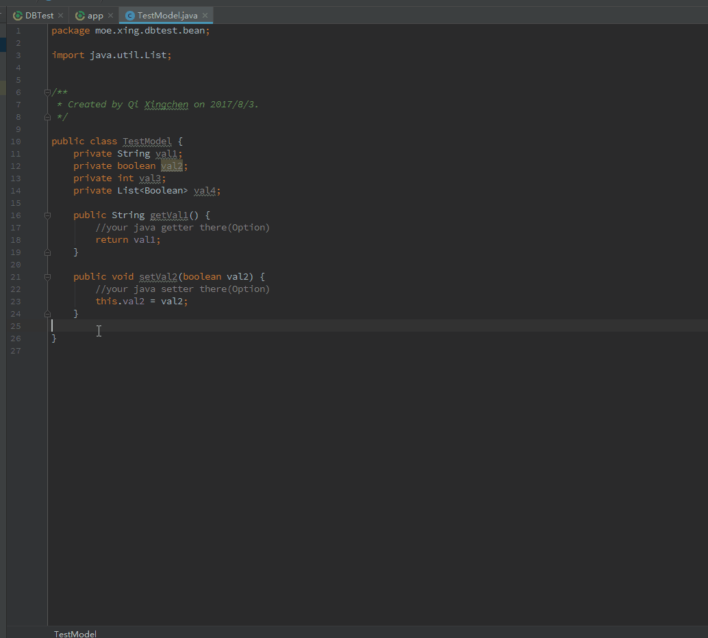
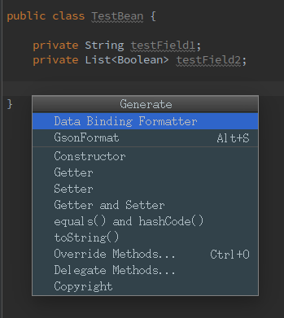
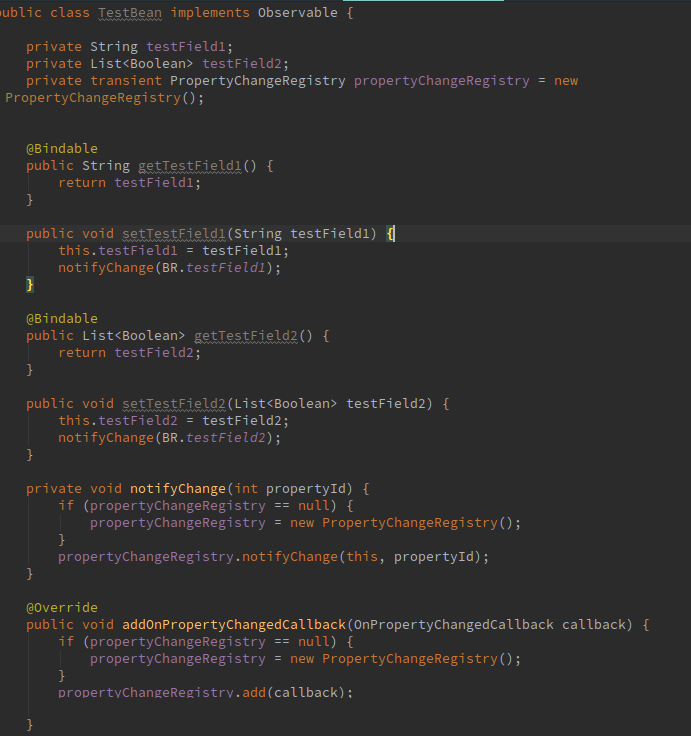

# DataBindingModelFormatter
quickly add data binding getter and setter for a model

After created model,open Generate window, select Data Binding Formatter.   

AndroidX supported.   

todo: 
- [x] find exits getter and setter. 
- [x] allow select field. 
- [ ] allow set notify method name.  

## screenshot

gif:  

Before Format: 

After Format: 

## download

You can download from [JetBrans Plugin Center](https://plugins.jetbrains.com/plugin/8616?pr=idea) 
or download from [github release page](https://github.com/Qixingchen/DataBindingModelFormatter/releases).