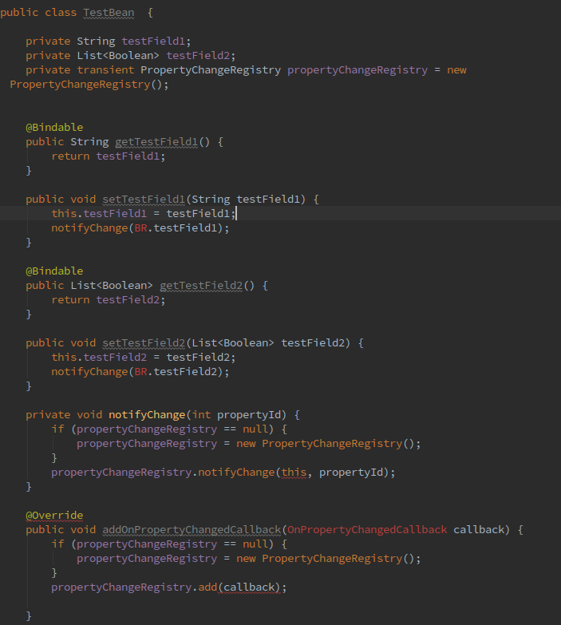

# DataBindingModelFormatter
quickly add data binding getter and setter for a model

After created model,open Generate window, select Data Binding Formatter. 
 
In this preview version, **you still have to manually add import for BR class and add implements Observable.** 
 
todo: 
- [ ] find exits getter and setter. 
- [ ] allow select field. 

## screenshot

Before Format: 

After Format: 

After Import BR class And Implements Observable: 

## download

You can download from [JetBrans Plugin Center](https://plugins.jetbrains.com/plugin/8616?pr=idea) 
or download from [github release page](https://github.com/Qixingchen/DataBindingModelFormatter/releases).